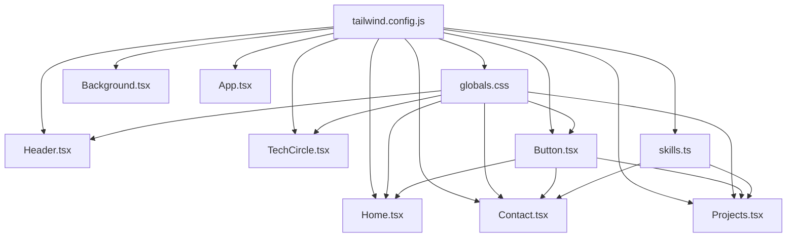

# Design Transformation Plan: Neon → Clean Modern Teal

## Overview

Transform the portfolio website from a dark neon aesthetic (blue-dark background, cyan/orange neon glow) to a clean, modern, minimalist design with a white background and elegant teal accents.

---

## Current Design Issues

| Aspect | Current (Neon) | Target (Clean Modern) |
|--------|----------------|----------------------|
| Background | Dark blue `#0a0e27` gradient | Clean white `#ffffff` |
| Primary color | Cyan `#00f0ff` (neon glow) | Teal `#0d9488` or `#14b8a6` |
| Secondary color | Orange `#ff6b35` (neon glow) | Eliminated |
| Typography | Gradient neon text | Solid dark `#111827` sans-serif |
| Borders | Neon glow borders | Thin solid borders |
| Glassmorphism | Dark glass `bg-white/10` | Light glass `bg-white/80` or `bg-gray-50` |
| Tech ring | Neon glowing rings | Thin gray rings |
| Tech icons | Colored neon (cyan/orange) | Monochrome teal |
| Buttons | Glass neon borders | Teal filled + teal outlined |

---

## Color Palette

### New Tailwind Colors

```js
colors: {
  teal: {
    50: '#f0fdfa',
    100: '#ccfbf1',
    200: '#99f6e4',
    300: '#5eead4',
    400: '#2dd4bf',
    500: '#14b8a6',  // Primary teal
    600: '#0d9488',  // Darker teal for hover
    700: '#0f766e',
    800: '#115e59',
    900: '#134e4a',
  },
}
```

### Text Colors
- Headings: `#111827` (gray-900)
- Body text: `#374151` (gray-700)
- Muted text: `#6b7280` (gray-500)

### Background
- Page: `#ffffff`
- Cards/sections: `#f9fafb` (gray-50) or white with subtle border
- Glass effect: `bg-white/80 backdrop-blur-md border border-gray-200`

---

## Files to Modify (in order)

### 1. [`tailwind.config.js`](tailwind.config.js)
- Remove `neon-cyan`, `neon-orange`, `neon-dark` colors
- Add teal color palette
- Remove neon box shadows (`neon`, `neon-orange`, `neon-glow`)
- Remove neon keyframes (`glow`)
- Keep `float` animation (useful for subtle motion)

### 2. [`src/styles/globals.css`](src/styles/globals.css)
- Change `body` background from dark gradient to `#ffffff`
- Change body text color from `text-white` to `text-gray-900`
- Update `.glass` class: `bg-white/80 backdrop-blur-md border border-gray-200 rounded-lg`
- Remove `.neon-border`, `.neon-border-orange`, `.neon-glow` classes
- Update `.gradient-text` to use teal gradient or solid dark color
- Update `::selection` to use teal
- Update `:focus-visible` to use teal outline

### 3. [`src/components/Background.tsx`](src/components/Background.tsx)
- Remove dark gradient background
- Replace with clean white or very subtle light gradient
- Remove particles dependency or keep minimal

### 4. [`src/App.tsx`](src/App.tsx)
- Change `bg-neon-dark` to `bg-white` on the root div

### 5. [`src/components/TechCircle.tsx`](src/components/TechCircle.tsx)
- **Name**: Change from gradient text to solid `text-gray-900` or `text-gray-800` with a clean sans-serif font
- **Title**: Change from `text-neon-cyan` to `text-teal-600`
- **Rings**: Replace neon cyan/orange animated borders with thin `border border-gray-200` or `border-gray-300` (no animation, or very subtle rotation)
- **Tech icons**: Change from colored (cyan/orange) to monochrome `text-teal-500`
- **Icon containers**: Remove `neon-border`/`neon-border-orange` classes, use clean `bg-white shadow-sm border border-gray-200`
- **Labels**: Change from `text-white/70` to `text-gray-500`

### 6. [`src/components/Button.tsx`](src/components/Button.tsx)
- **Primary variant**: `bg-teal-600 text-white hover:bg-teal-700` (filled teal)
- **Secondary variant**: `border border-teal-600 text-teal-600 hover:bg-teal-50` (outlined teal)
- Remove `neon` variant or replace with a subtle alternative
- Remove glass/neon classes

### 7. [`src/components/Header.tsx`](src/components/Header.tsx)
- Change header background from `glass border-b border-white/10` to `bg-white/90 backdrop-blur-md border-b border-gray-200`
- Logo: Change from `gradient-text` to `text-teal-600 font-black`
- Nav links: Change from `text-white/80 hover:text-neon-cyan` to `text-gray-600 hover:text-teal-600`
- Language switcher: Remove `neon-border` and `hover:shadow-neon-glow`, use `border border-gray-200 hover:border-teal-400`

### 8. [`src/pages/Home.tsx`](src/pages/Home.tsx)
- Scroll indicator: Change from `text-neon-cyan/60` to `text-gray-400`

### 9. [`src/pages/Contact.tsx`](src/pages/Contact.tsx)
- Title: Change from `gradient-text` to `text-gray-900` or `text-teal-700`
- Description: Change from `text-white/60` to `text-gray-500`
- Form labels: Change from `text-neon-cyan` to `text-teal-600`
- Input fields: Update glass styling for light theme
- Social cards: Remove neon borders/shadows, use clean borders with teal accents
- Submit button: Use new Button variants

### 10. [`src/pages/Projects.tsx`](src/pages/Projects.tsx)
- Page title: Change from `gradient-text` to `text-gray-900`
- Project cards: Remove `neon-border`, use `border border-gray-200 shadow-sm`
- Card titles: Change from `gradient-text` to `text-teal-700` or `text-gray-900`
- Modal: Update dark backgrounds to white/light
- Tech tags: Update colors to use teal palette
- Link buttons: Remove neon borders, use teal styling

### 11. [`src/data/skills.ts`](src/data/skills.ts)
- Update color/border values to use teal-based Tailwind classes instead of cyan/orange

---

## Mermaid Diagram: Component Dependency & Change Flow



---

## Execution Order

The implementation should follow this order to avoid broken states:

1. **Tailwind config** — foundation for all color changes
2. **globals.css** — base styles, glass, typography utilities
3. **Background.tsx** — white background
4. **App.tsx** — remove dark class
5. **Button.tsx** — new button variants (used by multiple pages)
6. **TechCircle.tsx** — core hero component
7. **Header.tsx** — navigation bar
8. **Home.tsx** — hero page adjustments
9. **Contact.tsx** — contact page
10. **Projects.tsx** — projects page
11. **skills.ts** — data layer colors

---

## Key Design Decisions

1. **Teal over cyan/orange**: Teal (`#14b8a6` / tailwind `teal-500`) provides a professional, modern feel while maintaining a tech-oriented identity
2. **White background**: Maximizes readability and gives a clean, portfolio-appropriate aesthetic
3. **Thin gray rings**: Maintains the tech-circle concept but in a subtle, elegant way without neon
4. **Monochrome teal icons**: Creates visual cohesion — all tech icons share the same accent color
5. **Filled + outlined buttons**: Matches the reference image's button pattern exactly
6. **Sans-serif typography**: Clean, professional look using Inter or system sans-serif fonts
