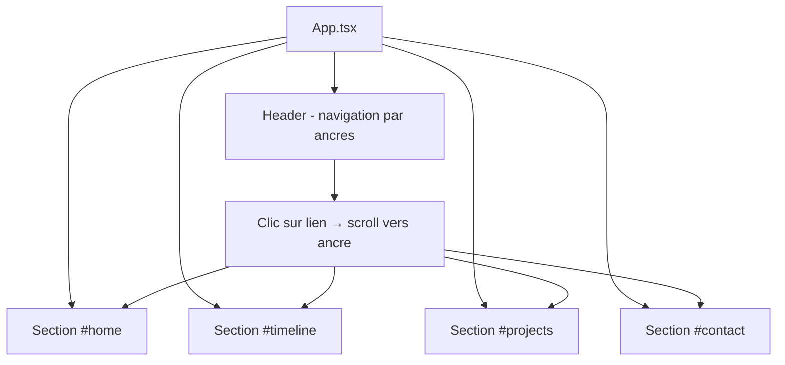

# Plan: Transformation en One-Page Portfolio

> **Note** : Ce plan remplace et annule les plans précédents (`projects-multi-images-filters-plan.md`, `design-transformation-plan.md`). Les fonctionnalités déjà implémentées (multi-images, filtres, carrousel, hero section) sont conservées et intégrées dans la nouvelle structure one-page.

## Objectif

Transformer le site multi-pages (React Router) en **single-page application** avec navigation par scroll. Toutes les sections sont sur la même page (`/`), le Header permet de scroller vers chaque section.

---

## Architecture actuelle vs cible

### Actuelle (multi-pages)
```
/          → Home.tsx (hero)
/projects  → Projects.tsx (grille + modale)
/contact   → Contact.tsx (formulaire)
```

### Cible (one-page)
```
/ → App.tsx (ou Home.tsx) contient toutes les sections :
    ├── #home      → HeroContent (TechCircle + tagline + boutons + réseaux)
    ├── #parcours  → Timeline (nouveau composant)
    ├── #projects  → Projects.tsx (grille + modale)
    └── #contact   → Contact.tsx (formulaire)
```

---

## Changements détaillés

### 1. [`src/App.tsx`](src/App.tsx) — Suppression du Router

- Remplacer `BrowserRouter` + `Routes` + `Route` par un simple fragment ou div
- Importer et rendre toutes les sections dans l'ordre
- Le `Header` reste, mais ses liens deviennent des ancres (`#home`, `#parcours`, `#projects`, `#contact`)

```tsx
function App() {
  return (
    <LanguageProvider>
      <div className="relative min-h-screen bg-white">
        <Background />
        <Header />
        <main>
          <HomeSection />
          <TimelineSection />
          <ProjectsSection />
          <ContactSection />
        </main>
      </div>
    </LanguageProvider>
  );
}
```

### 2. [`src/components/Header.tsx`](src/components/Header.tsx) — Navigation par ancres

- Remplacer les `<Link to="/...">` par des `<a href="#sectionId">` avec `scroll-behavior: smooth`
- Ajouter un nouvel item de navigation : **Parcours**
- Mettre à jour les locales avec `nav.timeline`

```tsx
<a href="#home" ...>{t('nav.home')}</a>
<a href="#timeline" ...>{t('nav.timeline')}</a>
<a href="#projects" ...>{t('nav.projects')}</a>
<a href="#contact" ...>{t('nav.contact')}</a>
```

### 3. [`src/pages/Home.tsx`](src/pages/Home.tsx) → Section `#home`

- Ajouter `id="home"` sur le conteneur principal
- Réduire le `min-h-screen` pour que ce soit juste une section, pas toute la page
- Les boutons CTA "View My Work" et "Contact" doivent scroller vers `#projects` et `#contact` au lieu de `navigate()`

### 4. Nouveau : [`src/components/Timeline.tsx`](src/components/Timeline.tsx) — Section `#parcours`

Composant de timeline verticale classique avec les données de parcours.

#### Interface des données

```tsx
interface TimelineEntry {
  id: number;
  year: string;
  title: string;
  company: string;
  description: string;
  type: 'education' | 'work';
  logo: string; // URL du logo de l'université/entreprise
}
```

#### Design

Timeline verticale avec :
- **Ligne verticale** à gauche
- **Logo de l'université/entreprise** dans un cercle sur la ligne (ex: logo CMU, logo Rennes University)
- **Carte à droite** avec année, titre, entreprise, description
- Les logos sont des images SVG ou PNG (via URL), affichées dans un cercle blanc avec bordure

```tsx
// Exemple de rendu d'une entrée
<div className="relative pl-12 pb-12">
  {/* Ligne verticale */}
  <div className="absolute left-5 top-0 bottom-0 w-0.5 bg-gray-200" />
  
  {/* Logo dans un cercle */}
  <div className="absolute left-0 w-10 h-10 rounded-full bg-white border-2 border-gray-200 flex items-center justify-center overflow-hidden">
    
  </div>
  
  {/* Carte de contenu */}
  <div className="bg-white border border-gray-200 rounded-lg p-4 shadow-sm">
    <span className="text-xs font-semibold text-teal-600">{entry.year}</span>
    <h3 className="font-bold text-gray-900">{entry.title}</h3>
    <p className="text-sm text-gray-500">{entry.company}</p>
    <p className="text-sm text-gray-600 mt-2">{entry.description}</p>
  </div>
</div>
```

#### Données

Les données seront définies dans [`src/data/timeline.ts`](src/data/timeline.ts) :

```ts
export const timelineData: TimelineEntry[] = [
  {
    id: 1,
    year: '2024 - 2026',
    title: 'Master en Intelligence Artificielle',
    company: 'Carnegie Mellon University Africa',
    description: '...',
    type: 'education',
    logo: 'https://logo.clearbit.com/cmu.edu', // ou une icône SVG inline
  },
  // ...
];
```

> **Note** : Les logos peuvent être soit des URLs distantes (Clearbit, etc.), soit des icônes SVG inline importées. On utilisera des URLs distantes par défaut, avec un fallback vers une icône générique (Building ou GraduationCap) si l'image ne charge pas.

### 5. [`src/pages/Projects.tsx`](src/pages/Projects.tsx) → Section `#projects`

- Ajouter `id="projects"` sur le conteneur principal
- Supprimer `pt-24` (le padding viendra du layout global)
- Garder toute la logique existante (filtres, modale, carrousel)

### 6. [`src/pages/Contact.tsx`](src/pages/Contact.tsx) → Section `#contact`

- Ajouter `id="contact"` sur le conteneur principal
- Supprimer `pt-24`
- Garder toute la logique existante (formulaire, liens sociaux)

### 7. [`src/locales/en.json`](src/locales/en.json) & [`src/locales/fr.json`](src/locales/fr.json)

- Ajouter `nav.timeline` → "Timeline" / "Parcours"
- Ajouter `timeline.title` et les données de traduction pour la timeline

### 8. CSS global ([`src/styles/globals.css`](src/styles/globals.css))

- Ajouter `scroll-behavior: smooth` sur `html`
- Ajouter `scroll-margin-top` sur les sections pour compenser le header fixe

```css
html {
  scroll-behavior: smooth;
}

section[id] {
  scroll-margin-top: 80px; /* hauteur du header */
}
```

---

## Dépendances

- **Aucune nouvelle dépendance** — tout se fait avec des ancres HTML + CSS
- On peut supprimer `react-router-dom` si plus rien ne l'utilise (vérifier)

---

## Checklist d'implémentation

### Étape 1 : Mettre à jour les locales
- [ ] Ajouter `nav.timeline` dans [`en.json`](src/locales/en.json) et [`fr.json`](src/locales/fr.json)

### Étape 2 : Mettre à jour le Header
- [ ] Remplacer `<Link>` par `<a href="#...">` dans [`Header.tsx`](src/components/Header.tsx)
- [ ] Ajouter le lien "Parcours" / "Timeline"

### Étape 3 : Créer le composant Timeline
- [ ] Créer [`src/data/timeline.ts`](src/data/timeline.ts) avec les données de parcours
- [ ] Créer [`src/components/Timeline.tsx`](src/components/Timeline.tsx) avec le design timeline verticale
- [ ] Ajouter les traductions pour la timeline dans les locales

### Étape 4 : Transformer les pages en sections
- [ ] [`Home.tsx`](src/pages/Home.tsx) : ajouter `id="home"`, remplacer `navigate()` par scroll vers ancres
- [ ] [`Projects.tsx`](src/pages/Projects.tsx) : ajouter `id="projects"`, ajuster padding
- [ ] [`Contact.tsx`](src/pages/Contact.tsx) : ajouter `id="contact"`, ajuster padding

### Étape 5 : Refondre App.tsx
- [ ] Supprimer `BrowserRouter`, `Routes`, `Route`
- [ ] Importer et rendre toutes les sections dans l'ordre
- [ ] Nettoyer les imports inutilisés

### Étape 6 : CSS
- [ ] Ajouter `scroll-behavior: smooth` et `scroll-margin-top` dans [`globals.css`](src/styles/globals.css)

### Étape 7 : Nettoyage
- [ ] Vérifier que `react-router-dom` peut être retiré (si plus utilisé)
- [ ] Supprimer les fichiers de pages devenus inutiles si nécessaire
- [ ] Build et vérification

---

## Diagramme de la structure finale



---

## Notes

- Le `Background` et le `Header` restent fixes comme avant
- Le modal des projets (ProjectModal) reste dans Projects.tsx, pas de changement
- La modale utilise `onClose` avec `setSelectedProject(null)`, pas de routage — donc compatible one-page
- Le smooth scroll est natif CSS, pas de librairie nécessaire
